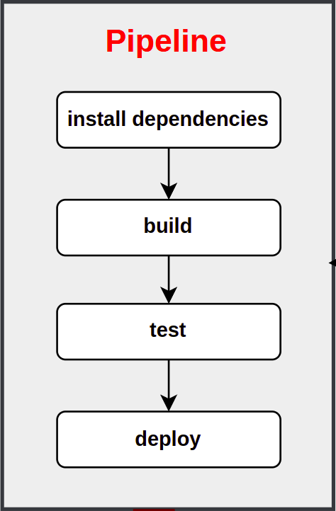

# Pipeline Process


#### Version Control
for version control I used: 
- **GIT**: is an open source distributed version control system designed to handle everything from small to very large projects with speed and efficiency

#### CI/CD (pipeline)
For CI/CD, I used 
- **CircleCi**: CircleCI is one of the world largest shared continuous integration and continuous delivery (CI/CD) platform, and the central hub where code moves from idea to delivery. As one of the most-used DevOps tools that processes more than 1 million builds a day

Pipeline is automating the process of taking code from version controle and making it available to user, and this process makes delivery process faster also it gives quickly feedback for developer.
- When developer push code to version control, this trigers circleCi to run the pipeline.
- Pipeline starts doing all jobs specified in ```.circleci/config/yml``` file in our case: 
  - **install dependencies**
  - **build** 
  - **test**
  - **deploy to production**
  