# Udagram Full-Stack Deployment Project
This is a Udacity project to deploy full-stack application, using **AWS services** for ***hosting*** and **Circle ci** for ***Continous Deployment***.
In our case a full-stack website that has *Angular* frontend, *Expressjs* backend and *postgresql* DB.
the website enables users to register, sign in and post feeds, but that is out of our consideration right now.

***Link to the App:-***
http://bahgat-udagram-bucket.s3-website-us-east-1.amazonaws.com/

## Infrastructure Description
### AWS Services
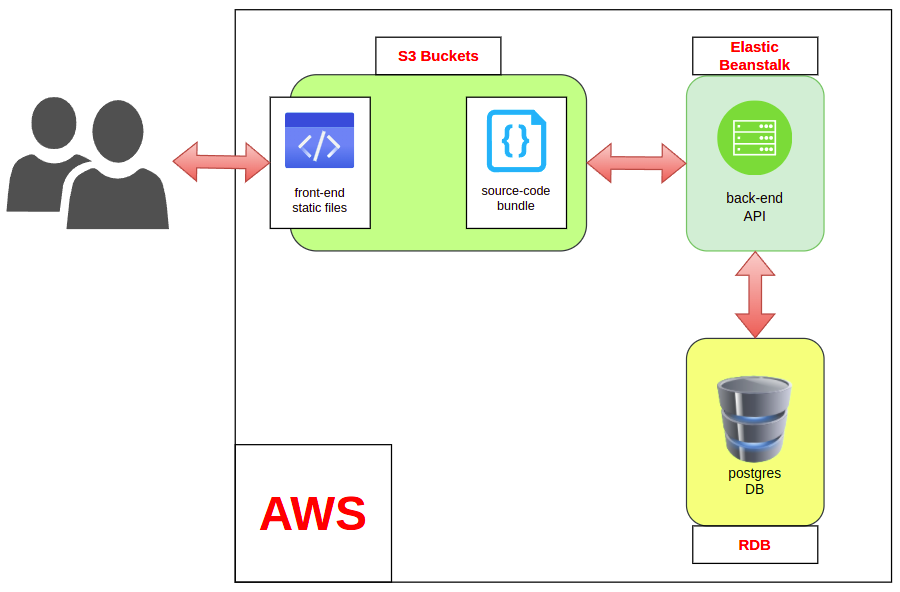
There are three AWS services that i used to deploy this project
- **S3 Bucket** : for serving front-end static files & storing source-code bundle
- **Elastic Beanstalk** : for hosting back-end API
- **RDS** : for hosting postgres database

### Pipeline Process
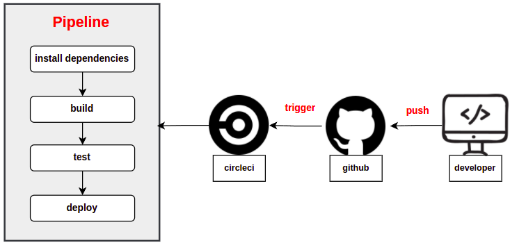
pipeline is automating the process of taking code from version controle and making it available to user
- When developer push code to version control, this trigers circleCi to run the pipeline.
- Pipeline starts doing all jobs needed for or before deployment like building the app and testing it before deploying to production .
- This makes delivery process faster also it gives quickly feedback for developer.

### The Big Picture
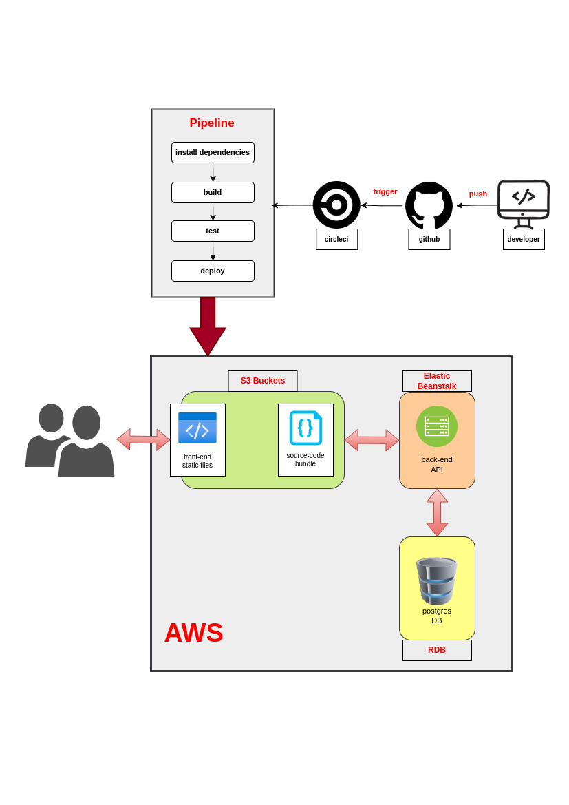
so shortly developer push code then pipeline starts deploying App on aws services so that end user can use the service

## App Dependencies
- Angular: front-end framework
- nodejs: javascript runtime env
- expressjs: back-end framwork
- npm: node package manager

## Screenshots
#### Website
gefore registeration
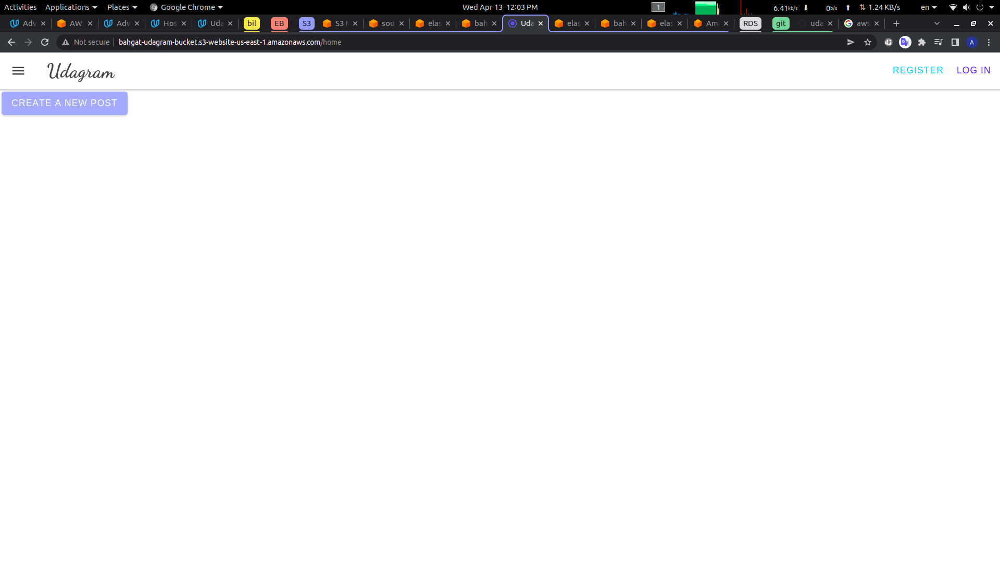
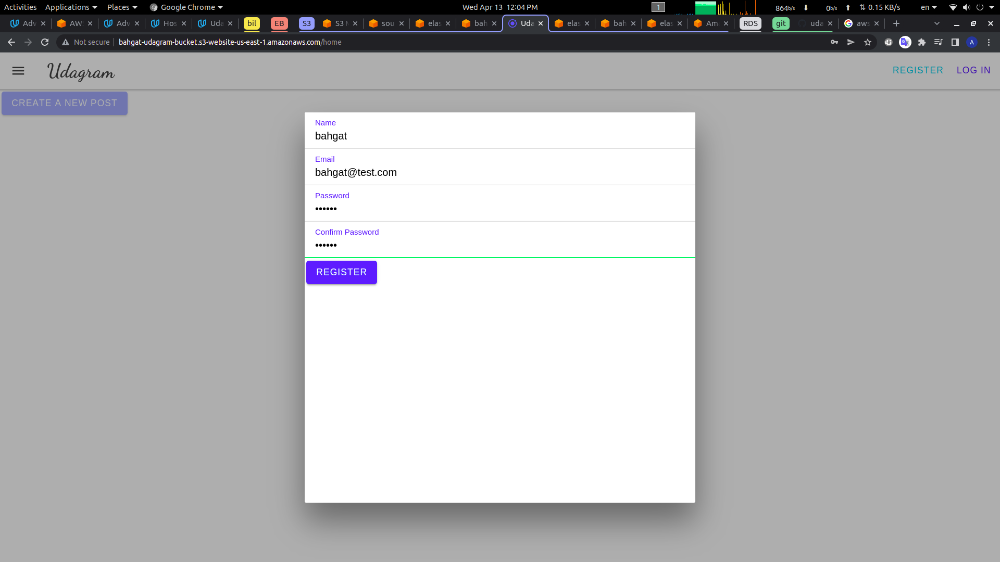
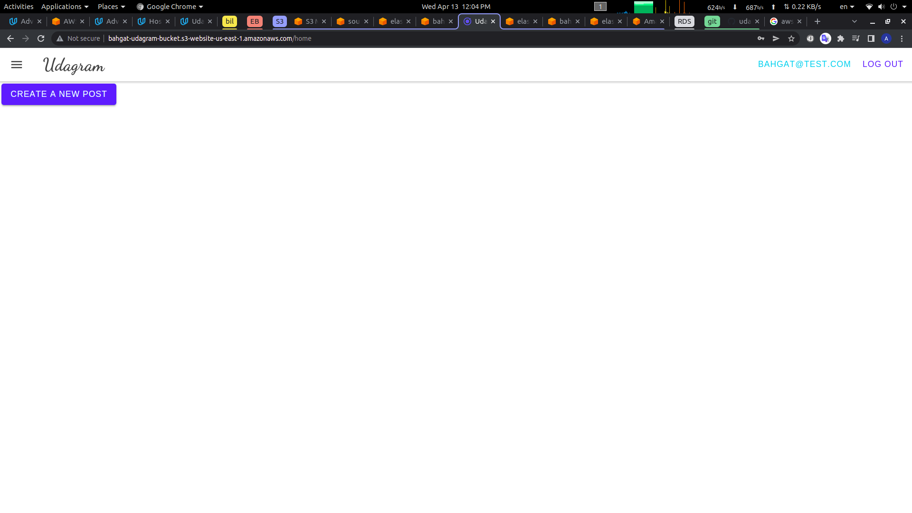
#### S3
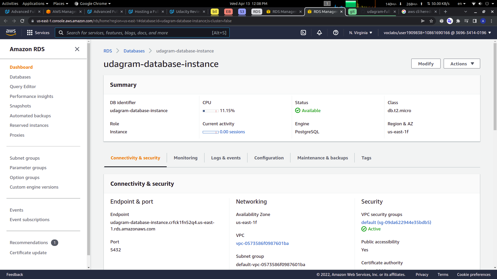
#### Elastic beanstalk
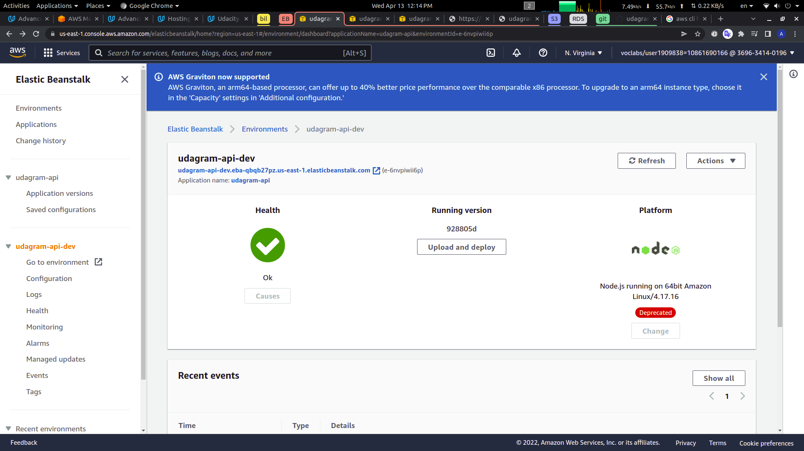
#### S3 Bucket
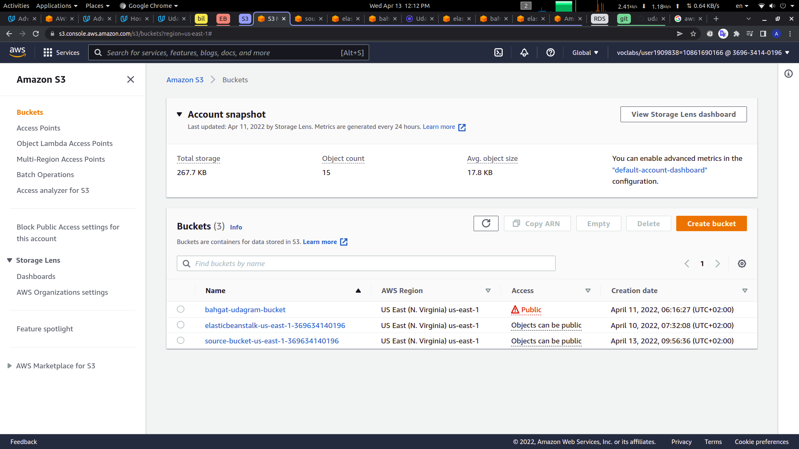

#### CircleCi
success pipeline after push on github
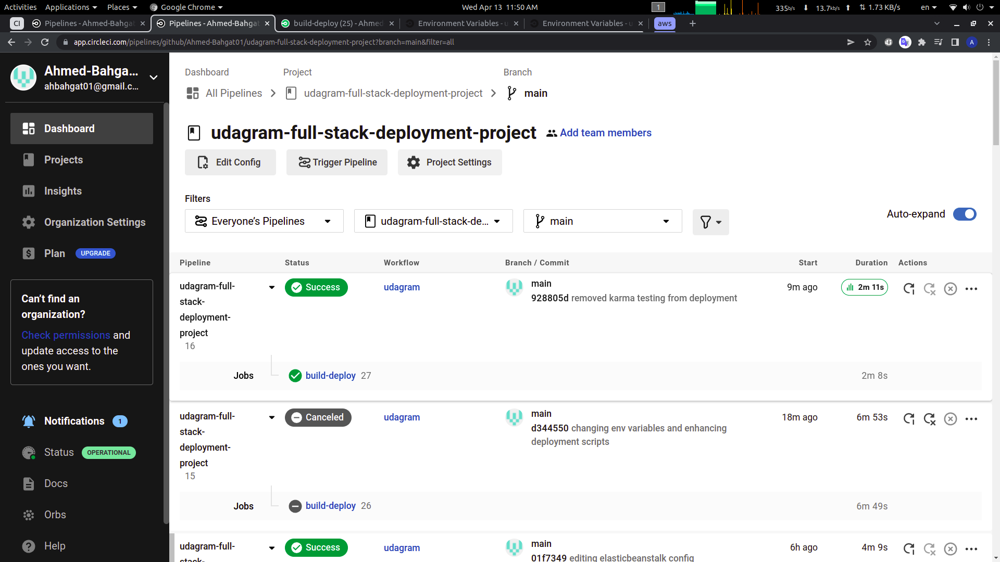
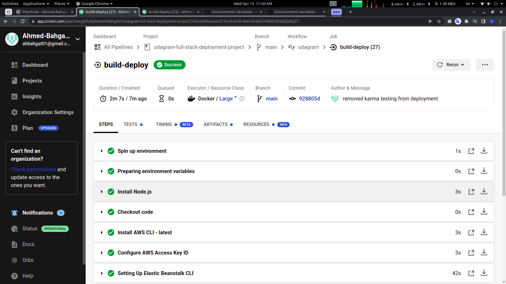
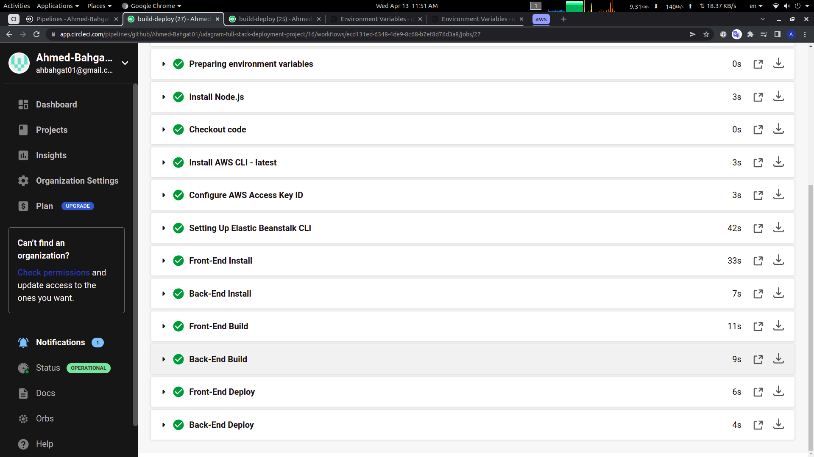
environment variables
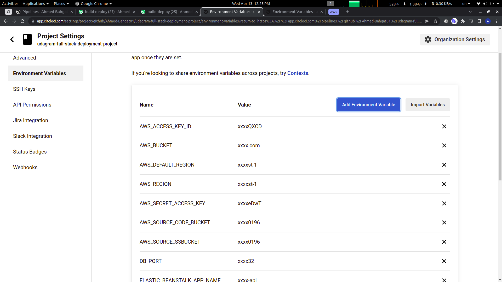

